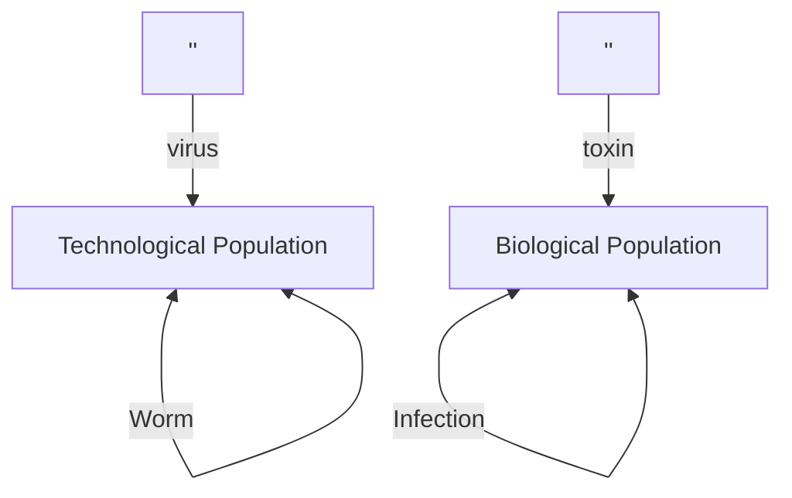
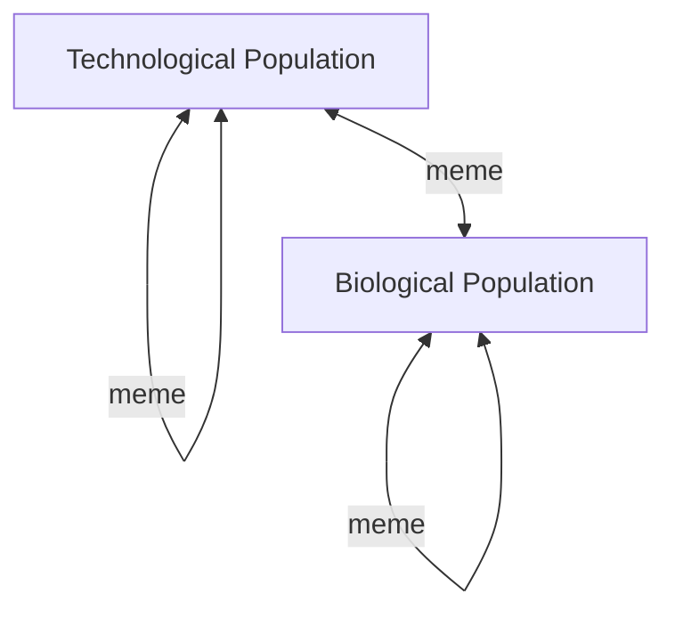

# Intro to Generative AI

## What is Generative AI?

...

### Type of Generative AI

...

#### Text (+ Code) Generation

#### Image (+ Video) Generation (3D Models)

#### Audio (+ Music) Generation

#### Multi-modal Generation

## DIY Generative AI

...

### App Integration

- Supabase SQL
- Mozilla MDN
- Figma/Buildah
- Canva

### Web Appkication

- Playground.com
- RunwayML.com
- Leonardo

### Local Appliances

### Local/Remote Code

### Your own app

#### Libraries

- Lang Chain
- LLMChain?
- AutoChain?
- Augogen
- MemGpt
- TaskWeaver

#### Models

##### Open

- GPT-1/2
- Playground
- Llama
-

###### Hosting Services

- Hugging Face
- Civitai

##### Proprietary

Palm
Gemeni
GPT-3/GPT-4
Anthropic

## How it works

### High level algebra/matrix multiplication

### Training

#### Step 1: pre-training

#### Step 2: fine-tuning

- Chat, Instruct, Function calling

#### Step 3: priming/prompting

#### Additional training

DreamBooth, Textual Inversion, Lora/Hypernetworks

## Now what - Futures speculation

### They took our jobs

### The rich/powerful might win (microsoft)

### Copy... wrong?

### Machines can be racist now

### Disease Analogs

## Learning Resources

Youtube channels
Hugging Face
Papers
